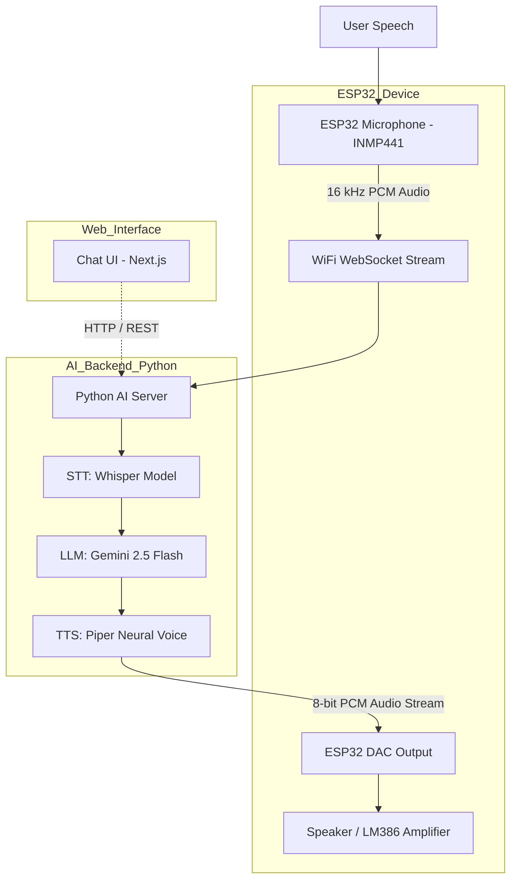

<div align="center">
  
  <p><strong>An AI-powered companion for students' mental well-being.</strong></p>
</div>
<br>

# AashaAI: AI-Powered Mental Health Companion

> “Empathy through embedded intelligence.”
> AashaAI is a hardware-integrated AI companion designed to enable real-time, voice-based interaction through a custom ESP32 device.
> It captures your speech, sends it to an intelligent backend that listens, understands and responds naturally.

---

## Overview

AashaAI combines **embedded systems** and **AI inference** to create an end-to-end conversational experience.
The **ESP32** handles real-time audio capture and playback, while the **AI backend** (Python server) performs:

* **Speech-to-Text (STT)** using Whisper
* **Language Understanding** via Google Gemini
* **Text-to-Speech (TTS)** using Piper

A simple **web interface** exists only for **text-based interaction**, allowing users to chat online with the same AI model, but the hardware device remains the core focus.

---

## System Architecture



---

## Hardware Architecture

| Component                | Function                                                           | Connection                 |
| ------------------------ | ------------------------------------------------------------------ | -------------------------- |
| **[ESP32-WROOM](https://robu.in/product/esp32-38pin-development-board-wifibluetooth-ultra-low-power-consumption-dual-core/)**                | Main microcontroller handling Wi-Fi, I2S mic input and DAC output |,                          |
| **[INMP441 Microphone](https://robu.in/product/inmp441-mems-high-precision-omnidirectional-microphone-module-i2s/)**   | Captures real-time voice input                                     | `SCK=14`, `WS=15`, `SD=32` |
| **[LM386 Amplifier](https://robu.in/product/lm386-audio-amplifier-module/)**      | Drives small speaker output                                        | Input from `DAC1 (GPIO25)` |
| **Speaker**              | Plays synthesized voice from AI                                    | Connected to LM386         |
| **Push Button**          | Triggers recording                                                 | GPIO 26                    |
| **LED**                  | Status indication                                                  | GPIO 2 (BUILT IN)          |

The hardware supports **half-duplex streaming**, recording speech, sending it to the backend, waiting for a response and then playing it back via DAC.

---

## Hardware Workflow

1. **Button Press**, ESP32 starts recording via the INMP441 microphone.
2. **I2S Audio Capture**, 16 kHz samples are streamed in real-time over WebSocket.
3. **AI Processing (Server)**

   * Whisper converts audio → text
   * Gemini 2.5 Flash generates a contextual reply
   * Piper converts text → natural speech
4. **Response Playback**, The server streams 8-bit PCM chunks back to ESP32 for DAC output.
5. **User Hears AI Voice**, LM386 amplifier drives the speaker.

---

## AI Backend (Python Server)

The **AI backend** acts as the brain of the device, hosted locally or on a VPS. It performs all heavy lifting, speech recognition, understanding and voice generation, so the ESP32 stays efficient.

### **Backend Modules**

| Layer                    | Description                                   | Library                 |
| ------------------------ | --------------------------------------------- | ----------------------- |
| **STT (Speech-to-Text)** | Converts voice input to text                  | `faster-whisper`        |
| **LLM (Language Model)** | Generates response based on transcribed query | `google-genai`          |
| **TTS (Text-to-Speech)** | Synthesizes natural human-like voice          | `piper-tts`             |
| **Transport Layer**      | Binary audio streaming and event control      | `websockets`, `asyncio` |

### **Processing Pipeline**

1. **Audio Reception**
   The ESP32 streams 16 kHz PCM data → server buffers in memory.
2. **Transcription**
   Whisper transcribes it into text using a lightweight `tiny` model for fast CPU inference.
3. **Response Generation**
   Gemini Flash LLM interprets intent and composes a short, empathetic response.
4. **Speech Synthesis**
   Piper TTS generates smooth, low-latency speech from text.
5. **Audio Encoding**
   Output audio is converted to 8-bit unsigned PCM and streamed back to the ESP32.

---

## Server Setup

```bash
cd esp-server
pip install uv
uv sync
uv run main.py
```

or via Docker:

```bash
docker build -t aashaai-server .
docker run -p 7860:7860 aashaai-server
```

> The server runs a WebSocket on `ws://0.0.0.0:7860` to communicate with ESP32.

### **Environment Requirements**

* Python ≥ 3.12
* Google Gemini API key (`GEMINI_API_KEY`)
* Pre-downloaded Piper voice model (`en_US-libritts_r-medium.onnx`)

> Model can be download using the following command:
> `RUN python -m piper.download_voices en_US-libritts_r-medium --data-dir tts_models`

---

## Website (Companion UI)

> The website is just an interface built with **Next.js 14**, **Tailwind CSS** and **Gemini 2.5 Flash**.
> It allows users without hardware to chat with the same AI model online.
> It does **not** handle any audio: all real-time speech functionality belongs to the hardware pipeline.

---

## System Highlights

* 🎧 **End-to-end Voice Interaction**, Speak → Understand → Reply → Speak
* ⚡ **Real-Time Processing**, WebSocket-based binary streaming under 100 ms latency
* 🔊 **High-Quality TTS**, Piper’s neural synthesis produces clean, expressive voice output
* 🧩 **Lightweight AI Core**, Whisper Tiny (CPU) enables fast offline operation
* 🧠 **LLM Personality Control**, Adjustable system prompt to alter the AI’s character
* 🔄 **Auto-Restart Watchdog**, `watcher.py` ensures uptime even after failure

---

## 📜 License

This project is released under the **MIT License**.
See [LICENSE](./LICENSE) for details.

---

## 💬 Acknowledgements

* [Weslei Prudencio for Project Inspiration](https://github.com/wprudencio)
* [Whisper by OpenAI](https://github.com/openai/whisper)
* [Piper TTS by Rhasspy](https://github.com/rhasspy/piper)
* [Gemini API by Google](https://ai.google.dev/)
* [ESP-IDF & Arduino Core](https://github.com/espressif/arduino-esp32)

---

> Built with ❤️ by **Arpit Sengar**
